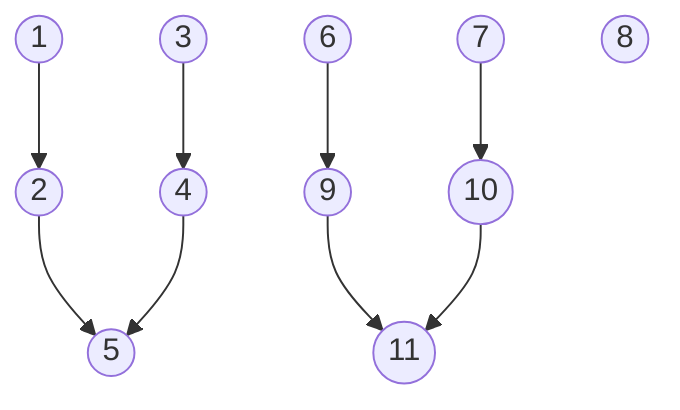
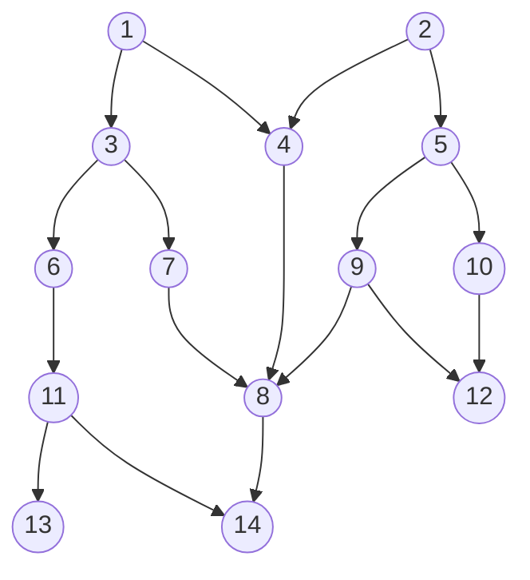

# Overview
___
Skill Trees that determine the proficiency of a weapon; the total points spent on the tree determines the proficiency level, which is also used by any general stats required by the weapon.

The first skill for every proficiency tree is the ability to understand and use the weapon correctly:

***Gain proficiency with this Weapon Type***

Every skill thereafter is created with the following rules in mind:

1. Must be interesting. No blatant stat increases (As proficiency increases, so should the stats).
2. Builds upon existing gameplay mechanics. A majority of skills should not introduce new stats or gameplay.

# Skill Trees
___
## Weapons
___
### Unarmed (Martial Arts)

Martial Arts encompasses all skills associated with hand-to-hand (or hand-to-weapon) combat using only the fists.

There are some weapons that can be used to heighten hand-to-hand combat, such as brass knuckles, but no weapon is required to use martial arts.

Examples:
	Wing-chun
	Karate

Skill Tree:

Skills:

| Skill                                             | Description                                                                                                    |
| ------------------------------------------------- | -------------------------------------------------------------------------------------------------------------- |
| (1) ***Exploding Palm***                          | Active Skill: Inflict Exploding Palm onto the target, causing the target to explode on death.                  |
| (2) ***Chain-Explosion***                         | Passive: Exploding Palm's on-death explosion applies Exploding Palm.                                           |
| (3) ***Seven-Sided Strike***                      | Active Skill: Deal 7 strikes at once against any nearby enemies.                                               |
| (4) ***Lion Fist***                               | Passive: Seven-Sided Strike performs an additional 7 strikes.                                                  |
| (5) ***Seven-Sided Explosion***                   | Passive: A strike from Seven-Sided Strike detonates Exploding Palm if the target is inflicted with the effect. |
| (6) ***Gentle Fist***                             | Active Skill: Parries an enemy's attack, and if successful, briefly disable target's bodily functions.         |
| (7) ***Fist of Flowing Water and Crushing Rock*** | Active Skill: Parries an enemy's attack, and if successful, briefly increase damage of a counter-attack.       |
| (8) ***Formless Fist***                           | Passive Skill: Increases the window to parry, and decreases the length of stuns.                               |
| (9) ***Quaking Fist***                            | Passive: Targets affected by Gentle Fist rapidly lose Stamina.                                                 |
| (10) ***Flowmotion***                             | Passive: Consecutive attacks increase damage and parry window.                                                 |
| (11) ***Deflect Missile***                        | Passive: Allows large ranged projectiles to be deflected.                                                      |
|                                                   |                                                                                                                |

### Blades (Swordsmanship)

Swordsmanship describes the capabilities that the character has when wielding a blade.

A sword is a hardened material sharpened to a dangerous edge that can be wielded safely using a handle (typically with one-hand).
- Handle
	- Safe material
- Blade
	- Sharp form
	- Resistant to breaking material

Examples:
	Swords
	Knifes

Skills:

| Skill           | Description |
| --------------- | ----------- |
| Warrior Stance  |             |
| Drunken Stance  |             |
| Ultimate Stance |             |
| Mage Stance     |             |

### Blunts (Bludgeoner)

A Bludgeoner excels with weapons intended to bash or crush opponents' tools, armor, or bones; as opposed to slicing or slashing.

Almost anything can be used to bludgeon someone to death, but typically are composed of a handle and sometimes a threatening appendage (typically held with one-hand). Blunt objects can be composed of a single material such as a: baseball bat, club, frying pan, etc.
- Handle
	- Safe material

Examples:
	Maces
	Flails
	Clubs
	Morningstars
	Keyblades

### Polearms (Polearmsmanship)

Polearms encompass the category of weapons that are designed to be used with two hands due to their size.

Polearms can be more complex than swords, as it can be a weapon on both ends or on only one. They are composed of either a large safe area for both hands to occupy, or two designated handles (one for each), and then a dangerous appendage on either both or one end.
- Handle
	- Safe material
- Appendage
	- Resistant to breaking material

Examples:
	Spear
	Lance
	Halberd
	Dual-blades

### Guns (Marksmanship)

Marksmanship refers to ranged weapons that are lethal based on their accuracy and precision, namely firearms.

A firearm is a complex structure composed of storing a sizable force that can be released at any time to create a projectile.
- Ammo Reserve
- Trigger
- Projectile
- Stored Force

Examples:
	Pistols
	Sub Machine Guns
	Assault Rifles
	Light Machine Guns
	Shotguns
	Snipers

Skills:

| Skill                    | Description                                                                                                                                                                                                                                                                                                                                                                        |
| ------------------------ | ---------------------------------------------------------------------------------------------------------------------------------------------------------------------------------------------------------------------------------------------------------------------------------------------------------------------------------------------------------------------------------- |
| ***Spring Force***       | Firearm projectiles have increased velocity and impact relative to how full the magazine is.                                                                                                                                                                                                                                                                                       |
| ***Trigger Discipline*** | Allows firearms to be crafted with a switch that changes between semi-auto, burst fire, and full-auto.                                                                                                                                                                                                                                                                             |
| ***Magic Bullet***       | When a firearm projectile is launched, consume a second one to create a magical bullet.                                                                                                                                                                                                                                                                                            |
| ***Ambidextrous***       | Allows a secondary handgun to be simultaneously used.                                                                                                                                                                                                                                                                                                                              |
| ***Recurve***            | Firearm projectiles slightly follow the target's (closest to the user's Line-Of-Sight) velocity.                                                                                                                                                                                                                                                                                   |
| ***Scattershot***        | Bullets are splintered into 3 fragments.                                                                                                                                                                                                                                                                                                                                           |
| ***Organ hunter***       | Allows critical hits.                                                                                                                                                                                                                                                                                                                                                              |
| ***Dismemberment***      | Joint shots have a chance of severing limbs.                                                                                                                                                                                                                                                                                                                                       |
| ***Headshot refund***    | Refills magazine on critical hits.                                                                                                                                                                                                                                                                                                                                                 |
| ***Tediore Reload***     | Throw weapon to reload.                                                                                                                                                                                                                                                                                                                                                            |
| ***Attunement***         | Magical bullets draw from the user's innate magical attunement: 	- Ice: Projectiles are encompassed in an icicle. (Deals Ice damage) 	- Electric: Projectiles are covered in static electricity. (Deals electric damage) 	- Fire: Projectiles become fireballs that expand on impact. (Deals fire damage) 	- Wood: Projectiles splinter on impact. (Deals wood damage) |

### Bows (Archery):

Archery is the practice of using ranged weapons to launch arrows.

Usually composed of strings and wood using the spring force built up from bending the wood and it snapping back into shape.
- String:
	- Flexible material
	- Resistant to breaking material
- Body:
	- Spring force

Examples:
	Shortbow
	Longbow
	Crossbow
	Composite Bow

Skill Tree:

Skills:

| Skill                | Description                                                                      |
| -------------------- | -------------------------------------------------------------------------------- |
| ***SmoothIsFast***   | Knock an arrow and draw it in a single motion.                                   |
| ***AdrenalineRush*** | Draw quickly, then more slowly.                                                  |
| ***EvasiveArrow***   | Hold a full draw after performing a quick maneuver.                              |
| ***ArrowCascade***   | Knock an additional arrow with each sequential shot.                             |
| ***Patience***       | Increases damage relative to how long the bow’s string is held.                  |
| ***Longshot***       | Damage is increased relative to how far the arrow has traveled.                  |
| ***Barrage***        | Knock multiple arrows and send them overhead.                                    |
| ***Fortress***       | Reduces damage taken during a full draw.                                         |
| ***Piecer***         | Draw forth the full strength of your bow to send forth a powerful piecing arrow. |
| ***RainOfArrows***   | Loose multiple barrages to cover a large sweeping area.                          |
| ***SteadyBreath***   | Reduce the strain placed on your body, and hold your breath when needed.         |
| ***TwistedShot***    | Twist your draw, creating a spin on the arrow.                                   |
| ***MultiShot***      | Knock multiple arrows for a single shot.                                         |
| ***SplinterShot***   | Fire an arrow that will splinter into multiple weaker arrows.                    |

## Armor

| Skills       | Description |
| ------------ | ----------- |
| Light Armor  |             |
| Medium Armor |             |
| Heavy Armor  |             |
| Shield Usage |             |
| Parry        |             |

## Skills
___
### Stealth

| Skill        | Description                                                                 |
| ------------ | --------------------------------------------------------------------------- |
| Pickpocket   | Potentially reach into a person's pockets without being noticed.            |
| Lockpick     | Potentially unlock a chest or door that is locked using a simple mechanism. |
| Haggle       | Potentially negotiate a lower price for items.                              |
| Sneak Attack | Attacks with advantage deal extra damage.                                   |
| Assassinate  | Attacks on surprised targets deal extra damage.                             |
| Lure         | Enemies are more likely to search areas that you create noises in.          |
| Silent Steps | You move quietly without trying, and tread more carefully when doing so.    |

### Athletics

| Skill        | Description                                                                               |
| ------------ | ----------------------------------------------------------------------------------------- |
| Sprinting    | Briefly expend energy to get to places faster.                                            |
| Climbing     | Footholds and grip come naturally to you.                                                 |
| Wall-Running | Shortly run up or parallel on walls with enough momentum.                                 |
| Sliding      | Transition from a high momentum standing gait to a crouch while maintaining a high speed. |
| Grappling    | Find more success when swinging with a rope or similar situations.                        |

